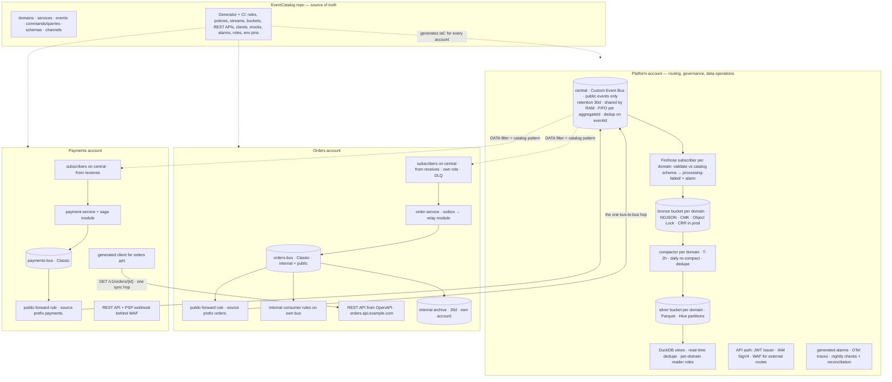

# Event & API platform — architecture

EventBridge-first, domain-owned, catalog-driven, in eu-west-1. Each domain account owns its Classic bus, its rules, its services and its API; the platform account owns the central bus — an EventBridge **Custom Event Bus** with 30-day retention, shared by RAM, on which each domain creates its own subscribers — the Firehose archive and compaction into *one bronze and one silver bucket per domain*, API auth, generated alarms, and per-domain read-only roles. EventCatalog is the source of truth for events *and* APIs — design-first OpenAPI modelled as commands and queries — and generates every account's IaC, gateways, clients, mocks and alarms. The data layer is S3 + Firehose + one compactor Lambda + Parquet, queried with DuckDB. PII in events is expected and classified: pseudonymous identifiers travel in clear, direct identifiers are encrypted per subject so erasure is a key deletion, special categories never travel. Every dataset the platform serves — each silver table, each domain's bronze, any gold built later — has an ODCS data contract generated from the same catalog entry and tested nightly. Nothing else (Athena, Glue, Iceberg, an orchestrator platform, a central edge, a data platform account) is built until a named trigger says so, and the trade-offs that buys are written down below.

## End state

Two domains are shown; every domain account has the same shape. Everything inside the platform and domain accounts is generated from the catalog. There is exactly one bus-to-bus hop per event (domain bus → central); everything after central is a subscriber delivering to a target the consumer owns. No subscriber ever targets a domain bus — see [ADR-021](adr/ADR-021-transport-routing-custom-bus.md) for why (`THIRD_ACCOUNT_HOP_DETECTED`, `LOOP_DETECTED`) and for the sequence diagrams.

## Glossary

- **central** — the platform's EventBridge **Custom Event Bus** (`eventsv2`): public events only, retained 30 days, shared to domain accounts by RAM. It replaces the Classic central bus and its native archive.
- **domain bus** — a domain's own EventBridge Classic bus: every event the domain publishes lands here; internal consumers are rules on it; one generated rule forwards public events to central. LocalStack emulates it.
- **subscriber** — the Custom Event Bus's routing unit: a filter (the catalog pattern as a `DATA` filter), one target, a delivery role, a retry policy and a DLQ, created in the *consuming* domain's account from its `receives[]`. There is no fan-out; a subscriber never targets a domain bus.
- **public / internal** — `visibility` in the catalog. Public events are forwarded to central and archived; internal events never leave the domain account.
- **audience** — `all` (default) or `restricted`; a subscriber to a restricted event is generated only with producer approval recorded in the catalog.
- **bronze / silver** — per-domain S3 buckets in the platform account: bronze is raw NDJSON written by Firehose (audit, replay source for analytics); silver is Parquet written by the compactor (query layer).
- **platform-local** — the versioned Terraform module a domain applies in licensed LocalStack to get a *Classic* stub central whose rules have the subscriber's shape (same filter, the consumer's queue as target), the archive shim, compactor and its own buckets, so it can test publication with no other domain present. The real Custom Event Bus is sandbox-only.
- **saga module** — the platform's in-domain stateful-process pattern (state table + Scheduler, or Step Functions template). Never a cross-domain workflow.
- **replay flag** — `replay: true` in the envelope on re-driven events, set by the consumer's generated subscriber from `aws:DeliveryType=REPLAY`; side-effecting consumers skip them. Replay itself is a temporary `POINT_IN_TIME` subscriber over central's retention.
- **x-pii** — the per-field classification in every catalog schema: `none` · `indirect` (pseudonymous ids, clear) · `direct` (encrypted per subject in public events) · `special` (never in any event).
- **subject-key service** — platform module holding a data key per subject under the owning domain's CMK; producers encrypt `direct` fields with it, listed `decryptors` fetch it, erasure deletes it (crypto-shredding).
- **ODCS** — Bitol's Open Data Contract Standard v3. Every dataset the platform serves (each silver table, each bronze, any gold) has one, generated from the event's catalog entry plus a small overlay, and tested nightly.
- **data product** — a silver table (or later a gold dataset) with its ODCS contract, consumers and freshness, rendered as its own catalog page linked to the event.

## Files

| File | Load it when |
| --- | --- |
| [decisions.md](decisions.md) | proposing or reviewing any infrastructure, routing, data or API design change; checking whether a service is permitted |
| [adr/](adr/) | challenging one decision — each ADR carries its `revisit_when` triggers in frontmatter |
| [trade-offs.md](trade-offs.md) | someone asks "why can't we…", or a symptom (duplicates, staleness, test gaps) needs explaining |
| [conventions.md](conventions.md) | writing or reviewing an event, an API operation, a consumer, or a catalog entry |
| [generation-and-ci.md](generation-and-ci.md) | changing the generator, adding a catalog field, or wondering why CI failed |
| [pii.md](pii.md) | any event or API that carries personal data; classification, encryption, erasure, the subject-key service |
| [data-layer.md](data-layer.md) | reading or writing bronze/silver; column types, layout, what is and isn't on disk |
| [data-contracts.md](data-contracts.md) | creating or consuming a dataset; the ODCS mapping, overlay, quality checks and catalog representation |
| [testing.md](testing.md) | writing tests for a domain, the platform, or a smoke; querying bronze/silver locally |
| [roadmap.md](roadmap.md) | planning work, deciding what is day-one vs trigger-gated, writing exit criteria |
| [prompts/](prompts/README.md) | running a roadmap step or a recurring operation with an agent — one self-contained prompt each, also installed as `/arch:*` commands |
| [prompts/spikes/](prompts/spikes/README.md) | proving the catalog-as-source-of-truth and the LocalStack bus mechanics in isolation, before day one |

## For AI agents

Read `decisions.md` before proposing infrastructure. Do not introduce Athena, Glue, Iceberg, Kinesis, Temporal, Step Functions outside the saga module, a central gateway, CloudFront, a Schema Registry or a data platform account unless the matching ADR's `revisit_when` trigger is cited with evidence. Every rule, bucket, route, client, alarm, role and data contract is generated from the catalog: change the catalog or the generator, never the account by hand. PII in events is classified per field (`x-pii`): `indirect` in clear, `direct` encrypted per subject, `special` never — see `pii.md` before touching a payload. Any dataset consumed outside its domain has an ODCS contract first. One synchronous hop between domains, through a generated client.
