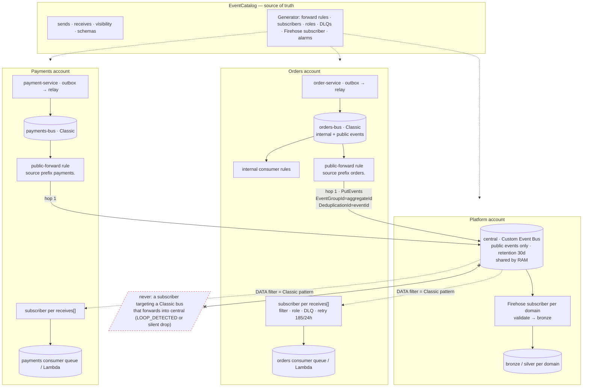
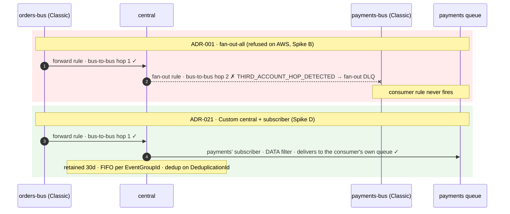

# ADR-021 · Transport & routing — Classic domain buses, Custom central bus

## Why ADR-001 is reopened

None of ADR-001's `revisit_when` triggers fired. Its **premise** failed: fan-out-all assumed an event could travel `domain-bus → central-bus → domain-bus` through EventBridge rules. EventBridge Classic delivers one bus-to-bus hop only.

Evidence, from a real account (`task sandbox-test` in Spike B): every two-hop test fails, and the fan-out rule's dead-letter queue holds the event with

```
ERROR_CODE     THIRD_ACCOUNT_HOP_DETECTED
ERROR_MESSAGE  Event ingestion rejected ... because an event can be sent to an event bus target only once.
               This event was previously delivered to an event bus target.
```

Each single hop passes. LocalStack (Community and licensed) delivers the chain, so the local suite was a false positive. AWS documents the limit on [eb-bus-to-bus](https://docs.aws.amazon.com/eventbridge/latest/userguide/eb-bus-to-bus.html) and [eb-cross-account](https://docs.aws.amazon.com/eventbridge/latest/userguide/eb-cross-account.html).

Of the three ways round it — a re-publisher Lambda behind the fan-out rule, domains publishing straight onto central, or the EventBridge **Custom Event Bus** relaunched on 2026-09-24 — Spike D tested the third and it gives, natively, the four things the platform account was going to assemble by hand: consumer-owned subscriptions, retention with replay, FIFO per aggregate, publish-time deduplication.

## Decision

Two kinds of bus, each with one job.

**Domain bus — EventBridge Classic, owned by the domain, unchanged from ADR-001.** The outbox relay publishes every event here. Internal events live and die here; internal consumers are Classic rules on this bus. One generated rule forwards the domain's public events to central. This is the part LocalStack emulates, so domain-local tests keep a real bus.

**Central bus — EventBridge Custom Event Bus (`eventsv2`), owned by the platform.** Public events only. Shared to each domain account with AWS RAM (`AWSRAMEventBridgeEventBusV2SubscribeOnly` to consumers; publish rights to the forward rules' roles). Retention set on the bus (ADR-023). **There is no fan-out.** Each domain creates, in its own account, one subscriber per entry in its `receives[]`, generated from the catalog: a `DATA` filter equal to the Classic pattern, a delivery role in its account, an explicit retry policy, a dead-letter queue, and the consumer's own queue or function as the single target.

**The relay sets `SystemMetadata.EventGroupId = aggregateId` and `SystemMetadata.DeduplicationId = eventId`** on every public event it forwards, so a consumer may choose `Type=FIFO` and so a duplicate publish inside the 5-minute window is suppressed at the bus (`SuccessCode=DEDUPLICATED`). Read-time dedupe in ADR-011 stays for duplicates outside the window.

**Hard rule:** no subscriber may target a Classic bus that forwards into the same central bus. Spike D: one direction is refused with `LOOP_DETECTED`, the other is dropped silently. Consumers subscribe to their own queues and functions, never through a domain bus.

## The topology



One bus-to-bus hop per event, from the domain bus into central. Everything after central is a subscriber delivering to a target the consumer owns. Replay (ADR-023) is a second, temporary subscriber on the same bus with a `POINT_IN_TIME` start.

### Why the ADR-001 shape fails and this one does not



## What this changes

| | ADR-001 | ADR-021 |
| --- | --- | --- |
| central | Classic bus + native archive | Custom Event Bus with retention |
| routing to a domain | platform-generated fan-out rule → domain bus → consumer rules | consumer-generated subscriber on central → consumer target |
| loop guard | `anything-but` own prefix in the fan-out pattern | none needed; plus the hard rule above |
| cross-account | bus resource policies | RAM share of the bus; subscriber role in the consumer's account |
| ordering / dedup | FIFO SQS target as a trigger; consumer dedupe | `EventGroupId` / `DeduplicationId` set by the relay |
| region | eu-west-2 (London) | **eu-west-1 (Ireland)** for the whole platform — decided 2026-10-04 because the Custom Event Bus has no London endpoint (eu-west-1, eu-central-1, eu-north-1, us-east-1 have one). Domain accounts deploy in eu-west-1 too; no cross-region hop. ADR-020 updated. |

## What does not change

Domain buses, the outbox relay module, the public-forward rule and its pattern, `sends[]`, the event envelope (ADR-022), bronze/silver buckets and their contracts (ADR-010, 012), the compactor (ADR-011), PII handling (ADR-007), one synchronous hop between domains (ADR-002), the catalog as the only source of IaC (ADR-017). The Classic patterns Spike A generates are used verbatim as `DATA` filters.

## New trade-offs

- **No local emulation of the central bus.** LocalStack has nothing for `eventsv2`. Domain-local tests use a Classic stub central whose rules target the consumer queues directly, which has the same shape as a subscriber; everything about the real central bus is proven in the sandbox (ADR-025).
- **Per-GB pricing**: $0.18/GB published, $0.05/GB delivered, $0.08/GB-month retained beyond one day, against $1 per million Classic events. Content-based dedup is billed separately; the relay uses `DeduplicationId`.
- **Subscriber lifecycle is sharper than rules.** One create/delete at a time per bus (the generator's apply serialises them); six create-only properties, so a target change is add-then-remove or a `POINT_IN_TIME` restart; default retry is 5 attempts in 300 s, so the generator always sets 185 / 86 400.
- **Region.** The platform and every domain account run in eu-west-1 rather than London. Data stays in the EU; UK-specific residency, if ever required, is the trigger above.
- **Tooling.** Terraform via `hashicorp/awscc` ≥ 1.104.0 (`awscc_eventsv2_event_bus`, `awscc_eventsv2_subscriber`, `_resource_policy`); `hashicorp/aws` has no resources yet. boto3 service name `eventbridgev2`.

## Implementation plan

1. Generator (Step 2): `receives[]` → `awscc_eventsv2_subscriber` in the consumer's account with filter, role, DLQ, retry policy, `MaxBatchSize=1` for Lambda targets; `sends[]` public → publish grant on the shared bus; relay sets `EventGroupId` / `DeduplicationId`. Patterns unchanged.
2. `platform-local` (Step 3): stub central stays Classic; "subscribers" are emitted as Classic rules on the stub central targeting the consumer queue. Same catalog input, two renderers.
3. Step 4 (real accounts): the first real central is the Custom bus in the platform nonprod account in eu-west-1, shared by RAM to the first domain account — the one assertion Spike D could not make with a single account.
4. Spike C runs against the Classic stub and must not claim two-hop delivery.

## How to change this

Open a PR that supersedes this ADR with the trigger named in `revisit_when` and the evidence that it fired. Update `decisions.md` in the same PR. Generated IaC follows the catalog, never the other way round.
