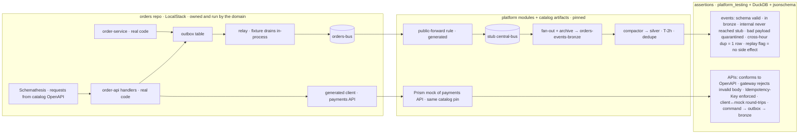

# Testing

A domain proves its own events and its own API end to end with nobody else present. The layers below are cumulative.

## Domain-local run



## Layers

### L0 · Contract (no infra · every commit)

- Events: an event built by domain code validates against the catalog JSON Schema; each `receives[]` handler is unit-tested against the catalog example payload
- APIs: Spectral ruleset + `oasdiff` in catalog CI; the generated client compiles against the pinned spec; handler unit tests use request/response examples from the spec
- Lifecycle: nothing may depend on a version past its sunset; breaking change needs a new version — CI, not a meeting

### L1 · Domain-local (LocalStack · every PR)

- Real service + outbox drained in-process → own bus → forward rule → stub central → fan-out + archive → own bronze; compactor → own silver
- Schemathesis drives the domain's own API from its catalog spec (gateway validation included); upstream APIs are Prism mocks of their catalog specs
- Asserts via DuckDB + jsonschema, including bad-payload quarantine, cross-hour duplicates, ciphertext checks and replay-flag handling; the local silver passes its ODCS contract test; seconds per test; no other domain present

### L2 · Platform (LocalStack + nightly real AWS)

- Synthetic events generated *from catalog schemas*, never a domain's code
- Bus-to-bus delivery, fan-out exclusion of own events, DLQ behaviour, Firehose partitioning and validation, compactor dedupe/idempotency/late-event re-compaction, native archive replay with the flag
- Generator output snapshot-tested: rule patterns, gateway bodies, authorizers, alarms, roles, ODCS contracts. The same suite runs nightly in a real sandbox account

### L3 · Smoke (real AWS · post-deploy)

- One `{domain}.SmokeTest.v1` event per domain → appears in its bronze bucket within the Firehose buffer; proves bus policies, fan-out, archive routing, cross-account
- One `GET /v1/health` per API through the real authorizer; proves DNS, gateway deploy, JWT/IAM, WAF where present
- Both marked public in the catalog, both excluded from silver; a quarterly replay drill from the native archive into `test`

## Querying what a domain published, locally

```
-- bronze: NDJSON from Firehose, readable within the buffer window
CREATE VIEW bronze AS SELECT * FROM read_ndjson_auto('s3://orders-events-bronze/**/*', union_by_name=true);
SELECT source, "detail-type", count(*) FROM bronze GROUP BY 1,2;                      -- what did we publish
SELECT count(*) FROM read_ndjson_auto('s3://orders-events-bronze/processing-failed/**/*');  -- contract violations
SELECT time, source, "detail-type" FROM bronze WHERE detail.correlationId = 'c-1' ORDER BY time;  -- one flow, API call included

-- silver: deduped at read time, so cross-hour duplicates never reach a query
CREATE VIEW silver AS
  SELECT * FROM read_parquet('s3://orders-events-silver/silver/**/*.parquet', hive_partitioning=true, union_by_name=true)
  QUALIFY row_number() OVER (PARTITION BY event_id ORDER BY bus_time) = 1;
SELECT dt, hour, detail_type, count(*) FROM silver GROUP BY ALL ORDER BY 1,2;         -- partition completeness
```
