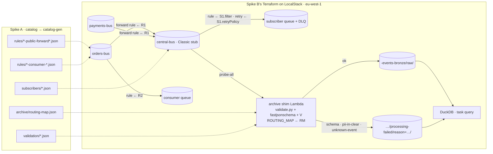

# Spike C — findings: the catalog drives the LocalStack buses

Run on 2026-10-04 on LocalStack **2026.09.0 licensed, `ENFORCE_IAM=1`** (ADR-025's L1 image), Terraform 1.9.8, hashicorp/aws 6.67, Python 3.12, `fastjsonschema` 2.22.2. Inputs: Spike A at its merged state (PR #2, `task all` green: 38 tests) and Spike B's modules (PR #1). Every claim names the test or command that proves it.

## Result

- [x] **go-with-changes.** Spike A's generator output drives Spike B's buses with no hand-written pattern, policy principal, routing map or validation schema left: 62 Terraform resources, every routing-shaped input read from `generated/local`. A catalog edit, regenerated, is the only way behaviour on the buses changes, and each edit's `terraform plan` is exactly the set of resources the edit implies (`snapshots/*.json`). The two spikes' findings **agree on the artefacts and disagreed on the topology**, and the disagreement is already settled: Spike B ran ADR-001's fan-out, Spike A generated ADR-021's subscribers, and Spike C builds what ADR-021/ADR-025 (accepted after both) prescribe for `platform-local` — the subscriber rendered as a Classic rule on a stub central. The changes needed before day one are generator hygiene and documentation, not architecture; they are listed under *Recommended changes*.

| Suite | Result | Time |
| --- | --- | --- |
| Spike B's suite, rebuilt for ADR-021 (`task -d spikes/B-localstack-buses-end-to-end test`) | 17 passed, 2 deselected (`sandbox`, `transformer`, both `xfail(strict)` when included) | ~1.5 min |
| Behaviour-through-the-catalog (`task -d spikes/C-join scenarios`) | 6 passed | ~6 min (5 LocalStack applies) |
| Spike A, unchanged (`task -d spikes/A-catalog-source-of-truth all`) | 38 passed, site builds, tree clean | ~2 min |
| `task -d spikes/C-join no-spike-markers` | clean | — |

**Follow-up applied in the same PR** (same day): the generator no longer emits fan-out rules and emits a consumer-owned target reference per subscriber (`targets: [{service, type: sqs, queue: <service>-inbox}]`); the shim packages the routing map with the bundle instead of an environment variable; `generation-and-ci.md`, `conventions.md`, `data-contracts.md`, `pii.md`, `roadmap.md`, `testing.md`, the README glossary, ADR-017/024/025, the root Node pin and this spike's prompt carry the edits listed under *Recommended changes* and Spike A's outstanding list. `causationId` is decided as *absent, never null*. Still open: the consumer queue is created by the domain on day one; Spike C's Terraform still creates one queue per subscriber.

Reproduce green (needs `LOCALSTACK_AUTH_TOKEN` in the shell for the licensed image; Community 4.14.0 also passes but cannot enforce IAM):

```sh
mise install
task -d spikes/C-join up        # LocalStack 2026.09.0, ENFORCE_IAM=1
task -d spikes/C-join apply     # catalog-gen → generated/local → terraform apply (≈2 min; aws_sqs_queue_policy ≈25 s each on LocalStack)
task -d spikes/C-join test      # B's suite behind the drift gates, then the scenarios
task -d spikes/B-localstack-buses-end-to-end query   # raw/ and processing-failed/ side by side, with reasons
task -d spikes/B-localstack-buses-end-to-end rules   # every deployed rule → the generated file it came from
task -d spikes/C-join no-spike-markers
```

## What was built



- **`terraform/envs/local/main.tf`** (Spike B, rewritten): `fileset()` over `rules/*-public-forward*.json` (split parts included), `rules/*-consumer-*.json` and `subscribers/*.json`; the domain list and the central bus's `PutEvents` principals come from the routing map and the forward-rule set; domain buses carry **no** cross-account policy because nothing outside the account puts events on them any more. A `generated_dir` variable lets a plan or apply point at any generator run. Probe and broken-target patterns are test scaffolding and stay inline — they are not catalog artefacts.
- **Subscriber rendering** (`module "subscriber"`): one Classic rule per `subscribers/*.json` on the stub central, `event_pattern = .filter`, `retry_policy = .retryPolicy` (new variable on `bus-sqs-rule`), its own DLQ, one SQS target named after the subscriber. Same-domain `receives[]` become `module "consumer_rule"` on the domain bus. There is no fan-out module.
- **Archive shim** (`modules/bus-s3-archiver`, ADR-024): the zip is built by `archive_file` from `src/handler.py`, `src/validate.py`, a `uv pip install --target` of `fastjsonschema`, and `generated/validation/*.json`; `ROUTING_MAP` is an environment variable. `validate.classify` returns `None` or `(reason, message)`; the key is `raw/source=…/detail_type=…/<id>.json` in the domain's bronze bucket, or `processing-failed/reason=<schema|pii-in-clear|unknown-event>/…` there (or in `platform-events-bronze` when no prefix matches). DuckDB views `archive`, `quarantine` and `bronze` read every bucket.
- **Drift gates** in Spike B's `task test`: `catalog-gen check` (catalog → generated) and `terraform plan -detailed-exitcode` (generated → applied) run before pytest; `task apply` regenerates first.
- **Scenarios** (`C-join/tests`): copy the catalog, apply one edit, `catalog-gen build`, `terraform plan -out`, `terraform show -json` reduced to `{address, actions, changed attributes, event_pattern before/after, shim environment before/after}`, compared with the committed snapshot, then apply and prove delivery with a real event, then revert and prove it stops.

## Behaviour through the catalog

| Catalog edit | `generated/` files that change (asserted equal) | `terraform plan` (snapshot) | Behaviour proved |
| --- | --- | --- | --- |
| `order.aggregate.updated`: `x-visibility: internal → public` | `rules/orders-public-forward.json`, `archive/routing-map.json`, `validation/orders.json`, `parquet/order.aggregate.updated.v1.json`, `deploy-order.json` | **2 resources**: the orders forward rule's `event_pattern` gains `order.aggregate.updated.v1`; the shim's `source_code_hash` (the bundle and the routing map are packaged in its zip) — `1-flip-internal-to-public.json` | The event reaches the central probe and lands in `orders-events-bronze/raw/`; no subscriber receives it; the catalog's own example for the event (email in clear inside `order`) is quarantined `pii-in-clear` because `order` is `x-pii: direct` and must now be ciphertext — `test_public_event_now_reaches_central_and_bronze_then_stops_when_reverted` |
| revert | same five | the same 2 resources, reversed — `1-revert-to-internal.json` | The event is seen on `orders-bus` only; nothing on central, nothing in bronze |
| `payment-service` `receives: order.aggregate.updated` (public, cross-domain) | `subscribers/payments-order-aggregate-updated.json`, `deploy-order.json` (+ two channel pages inside the catalog copy) | **6 resources created, all in `module.subscriber["payments-order-aggregate-updated"]`**: rule, target, queue, DLQ, two queue policies — `2-add-cross-domain-receives.json` | The deployed rule's pattern equals the generated filter; the event arrives on the new queue with `detail` intact — `test_subscriber_delivers_then_stops_when_receives_is_removed` |
| remove it | same two | the same 6 resources deleted — `2-remove-cross-domain-receives.json` | The rule is gone from central; the bus still carries the event (central probe) |
| `order-service` `receives: order.aggregate.updated` (internal, same domain) | `rules/orders-consumer-order-aggregate-updated.json`, `deploy-order.json` | **6 resources created in `module.consumer_rule[…]`** on `orders-bus` — `3-add-same-domain-receives.json` | Delivered to the consumer queue on the domain bus; never reaches central — `test_same_domain_receives_changes_only_a_consumer_rule_on_the_domain_bus` |
| remove it | same two | 6 deleted — `3-remove-same-domain-receives.json` | The rule is gone from `orders-bus` |
| edit the catalog, do not regenerate | — | — | `task test` fails in `catalog-gen check` before any delivery test (`test_task_test_runs_the_drift_gates_before_the_suite` checks the wiring; Spike A's `test_check_fails_after_one_character_edit` proves the check bites); regenerate without applying and the `plan -detailed-exitcode` gate fails instead |

The second table is the one the prompt asked for in Spike B's suite, re-stated for ADR-021 (`spikes/B-localstack-buses-end-to-end/tests/test_buses.py`):

| Claim | Test |
| --- | --- |
| A public event reaches central in one hop and the forward DLQ stays empty | `test_public_event_reaches_central_in_one_hop` |
| It reaches the consuming domain through its subscriber, not through its bus; envelope preserved, new `id` on central | `test_public_event_reaches_payments_subscriber_queue`, `test_payment_captured_reaches_orders_subscriber_queue`, `test_envelope_preserved_through_forward_and_subscriber` |
| Nothing is ever delivered back to a domain bus; an internal event never leaves its bus | `test_nothing_is_ever_delivered_back_to_a_domain_bus`, `test_internal_event_never_reaches_central_or_a_subscriber` |
| The subscriber filter is exactly the `receives[]` entry (another event name from the same domain is not delivered) | `test_subscriber_filter_is_exactly_the_receives_entry` |
| Every deployed rule on every bus that is not scaffolding has a generated file with the identical pattern, and no fan-out rule exists | `test_every_deployed_rule_is_a_generated_file`, `test_no_fan_out_rule_exists_on_central` — this is generation-and-ci.md's nightly "every EventBridge rule exists in `generated/`" guardrail, running locally |
| A valid public event is archived raw in **its domain's** bronze bucket; a missing required field → `processing-failed/reason=schema`; a `direct` field in clear → `reason=pii-in-clear`; an event not in the catalog → `reason=unknown-event` in the fallback bucket; internal events are never archived | `test_valid_public_event_is_archived_in_its_domain_bucket`, `test_schema_violation_is_quarantined`, `test_direct_field_in_clear_is_quarantined`, `test_unknown_event_on_central_is_quarantined_in_the_fallback_bucket`, `test_internal_event_is_never_archived` |
| DuckDB shows both prefixes with the reason as a Hive column | `test_duckdb_shows_raw_and_quarantine_prefixes`, `task query` |
| At-least-once still holds on Classic (dedup is the Custom bus's, Spike D) | `test_duplicate_put_is_delivered_twice` |
| Patterns stay tiny; DLQ records and the input transformer remain sandbox-only | `test_pattern_sizes_under_4kb`; `test_broken_target_lands_in_dlq`, `test_input_transformer_on_bus_target` (`xfail(strict)`) |

`task query` after `task test`:

```
┌───────────────────┬───────────────┬──────────────────────────┬────────────────────┬────────┐
│      status       │    reason     │          source          │    detail_type     │ events │
├───────────────────┼───────────────┼──────────────────────────┼────────────────────┼────────┤
│ processing-failed │ pii-in-clear  │ orders.order-service     │ OrderPlaced.v1     │      3 │
│ processing-failed │ schema        │ orders.order-service     │ OrderPlaced.v1     │      1 │
│ processing-failed │ unknown-event │ orders.order-service     │ OrderCancelled.v1  │      1 │
│ processing-failed │ unknown-event │ platform.spike           │ BrokenTargetProbe… │      1 │
│ raw               │ NULL          │ orders.order-service     │ OrderPlaced.v1     │      9 │
│ raw               │ NULL          │ payments.payment-service │ PaymentCaptured.v1 │      2 │
└───────────────────┴───────────────┴──────────────────────────┴────────────────────┴────────┘
```

## Reconciling A and B: what the two spikes assumed differently

1. **Topology.** B ran and proved the ADR-001 shape (fan-out to domain buses, consumer rules on the domain bus) and then disproved its second hop on AWS. A generated the ADR-021 shape (subscribers on central). They never had to agree because C is where they meet, and ADR-021/025 were accepted in between. C follows ADR-025's L1 rendering. **Consequence for the generator:** `rules/*-fan-out.json` and `*-fan-out.enumerated.json` are still emitted "for the platform-local stub", but the stub needs no fan-out — the subscriber rule on central is the stub. Nothing consumes them; `test_every_deployed_rule_is_a_generated_file` has to exclude them by name. They should go. The prompt's "select the enumerated form via a generator flag" is moot twice over: B found `anything-but`+`prefix` supported, and there is no fan-out.
2. **The patterns themselves agree byte for byte** (up to key order): A's golden `rules/orders-public-forward.json` is B's hand-written one; A's `subscribers/payments-order-placed.json#filter` is B's `payments-consumer-order-placed.json`. The prompt's premise — "hand-written in exactly the shape the generator will emit" — held.
3. **Region.** B was built in `eu-west-2`; ADR-021 moved the platform to `eu-west-1`. C's local env, Taskfile, harness and probe now say `eu-west-1`.
4. **Bus policies.** B gave every domain bus a `PutEvents` policy for the platform account (the fan-out needed it). Under ADR-021 nothing outside the account publishes to a domain bus, so the generated principal list for a domain bus is empty and only central carries one — on AWS that list becomes the RAM share plus the forward roles. generation-and-ci.md still says "central and domain bus policies".
5. **Consumer target naming.** B named queues `{domain}-consumer-{event}`; A's subscriber carries `name: {domain}-{event}` and `targets: [service]`. C names the queue after the subscriber and records the services as a tag. The subscriber file needs a **target reference** (a queue or function the consumer owns), not just the service id, before Terraform can point at the consumer's real queue; today `maxBatchSize: 1` and `targets` are decoration.
6. **Archive.** B's stretch shim wrote everything raw to one `central-archive` bucket; A's routing map wants a bucket per domain; ADR-024 wants `processing-failed/`. C does all three. Two bundle facts surfaced: (a) the generated validation schema uses only draft-07-level keywords, so `fastjsonschema` (pure Python, no compiled dependency, 11 files in the zip) validates it identically to `jsonschema` for every case A tests — it ignores `format: decimal` and `contentEncoding`, which `pattern` and `minLength` already cover; (b) the bundle plus `ROUTING_MAP` make a catalog change a **code change of the shim** (`source_code_hash`) rather than a config change, which is honest but means the plan shows the Lambda, not "the routing map".
7. **Flipping visibility is never a one-line PR.** The moment `order.aggregate.updated` is public, its `order` field is `x-pii: direct` and must be ciphertext on the wire; the event's own catalog example (email in clear) is quarantined `pii-in-clear` by the shim. Spike A's `check_examples_match_schema` would fail that PR before it merged. Both spikes assumed this implicitly; C makes it observable.
8. **`causationId: null` is a schema violation.** B's test helper sent `causationId: None` (conventions.md lists it without saying it may be null); A's `Envelope.json` types it `string`, not required. The generated bundle therefore rejects an explicit null. Either the convention says "omit, never null" or the schema becomes `type: [string, null]`. C's tests use the catalog examples, which omit nothing and null nothing.
9. **Drift has two halves.** `catalog-gen check` catches a catalog edited after the last generate; it cannot see a generate that was never applied. generation-and-ci.md's "generated output … up to date" names only the first. `terraform plan -detailed-exitcode` is the second gate and is cheap (≈30 s on LocalStack).
10. **Timing.** LocalStack's `aws_sqs_queue_policy` at ≈25 s each (B's finding) is what makes each scenario apply a minute: a subscriber is a queue, a DLQ and two policies. Day-one L1 suites should pre-create consumer queues once per run, or set the policy inline on `aws_sqs_queue` and measure.

## What differed from `docs/architecture/`, in one list

- `generation-and-ci.md` "central and domain bus policies" → central only (domain buses need none under ADR-021); add the second drift gate; say the validation bundle is consumed by the shim locally and Firehose on AWS; say the routing map's `detailTypes` is the shim's `ROUTING_MAP` and has an env-var size ceiling (≈4 KB total) — package it with the bundle instead.
- `generation-and-ci.md` nightly "every EventBridge rule in every account exists in `generated/`" → runs locally too, as `test_every_deployed_rule_is_a_generated_file`; worth a `platform_testing` helper.
- Step-2 generator scope (`roadmap.md`): drop fan-out emission; emit a target reference per subscriber; the "Classic-rule twin for `platform-local`" needs no separate file — Terraform renders `subscribers/*.json` directly (C's `module "subscriber"`), which keeps one source for both renderings and removes the drift ADR-025 worries about.
- `roadmap.md` Step 2 "Prove: flip an event to public → the plan shows the forward rule, Firehose routing, silver schema and an alarm, nothing else" → on LocalStack the plan shows the forward rule and the shim (routing + bundle); silver schema and alarms are not deployed resources in the spike. The proof shape (plan snapshot per catalog edit) is `C-join/tests/scenarios.py` and should be lifted as is.
- `roadmap.md` Step 1 "Build" → C's `envs/local` + `bus-s3-archiver` already is the bus-and-archive half of the walking skeleton; Step 1 should start from these modules rather than re-derive them.
- `conventions.md` `causationId` → decide null vs omitted (item 8).
- ADR-024 → name the validator (`fastjsonschema`, pure Python) and state that the bundle ships inside the shim; the Firehose transform imports the same `validate.py`.
- ADR-025 → add `terraform plan -detailed-exitcode` as the generated→deployed gate in L1 and the rule scan as a local test.
- The Spike C prompt itself was written for ADR-001 ("the payments probe", "fan-out", "enumerated form via a generator flag"); under ADR-021 the observable for a visibility flip is central + bronze, and for `receives[]` the subscriber queue. If the prompt stays as a reusable command it should be reworded.
- Still outstanding from Spike A's list: root `.mise.toml` Node 22, `x-` prefixed keys in `conventions.md`/`generation-and-ci.md`, ODCS path and `logicalType`, generated command/query pages.

## Open questions

- Who creates the consumer's queue on day one — the domain (and the subscriber references it by ARN/name) or the subscriber module (as here)? ADR-021 says the consumer's own queue; the generator must then emit a reference, and L1 must stub it.
- Does a `retry_policy` on a Classic SQS target add anything over the default? It is accepted and recorded; the semantics that matter are the eventsv2 subscriber's (Spike D). Kept so the two renderings carry the same numbers.
- One validator or two: A's tests use `jsonschema`, the shim uses `fastjsonschema`. Add a bundle test in A that runs both over the examples and the negative cases, or pick one.
- `test_broken_target_lands_in_dlq` is still `xfail(strict)` on the licensed image: with `ENFORCE_IAM=1` the delivery is denied (B's second pass) but no DLQ record is written. Unchanged from B; sandbox-only.
- Spike B's real-AWS env (`terraform/envs/sandbox`, the `THIRD_ACCOUNT_HOP_DETECTED` proof) was deleted with the hand-written patterns it read; it is at commit `eea52e9` and its result is recorded in Spike B's findings and ADR-021. Spike D's Terraform is the real-AWS environment from here on.

## Recommendation

**Proceed to day one, with the changes above folded in first** — none of them is architectural. The join holds end to end: the generator's output is sufficient to build the buses, the subscribers, the archive routing and the validation with nothing written by hand; the plan for each of the three canonical catalog edits is exactly the resources that edit implies and is committed for review; delivery starts and stops with the edit; and both halves of drift fail `task test`. Spikes A and B agree on every artefact and differed only on a topology that ADR-021 had already settled between them. What day one needs from the generator is hygiene (drop fan-out, emit a target reference, package the routing map), from the docs the second drift gate and the domain-bus-policy correction, and from Step 1 the decision to start from these modules and this scenario-snapshot pattern rather than rebuild them.
